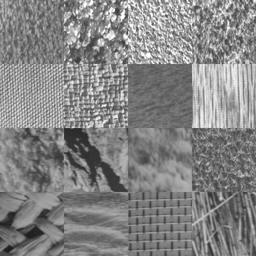
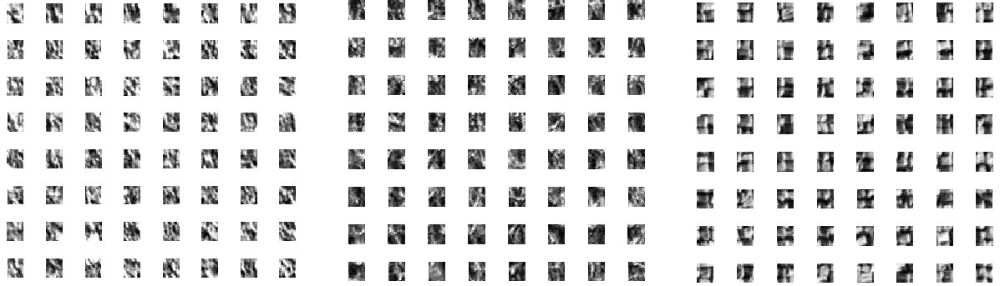
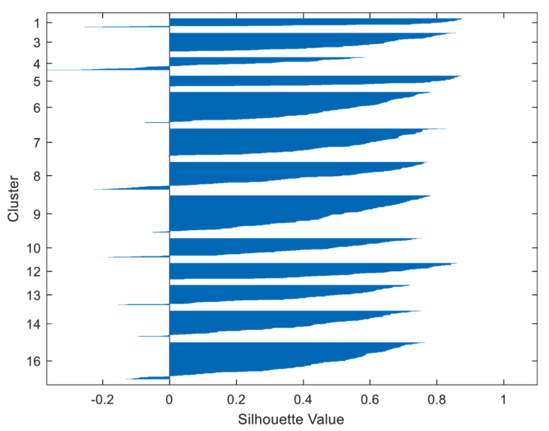

# OHNOmonia
A classifier that differentiates x-rays of healthy chests from those infected with bacterial and viral pneumonia.

---
### Test and Train Dataset Source
All test and train dataset images were taken from:
[Kaggle](https://www.kaggle.com/paultimothymooney/chest-xray-pneumonia) 

---
### Texture Classifier Test
I first tested the k-means algorithm in Matlab, using the following image of 16 different textures:

I split each of the textures into 8x8 small squares (16x16 pixels), resulting in 1024 small squares across all 16 textures. Here is a sample of three textures split in this manner:

After randomly scattering the small squares, and performing the k-means algorithm on them, the following silhouette graph was produced:

The silhouette graph wing density indicates how many of the small squares were classified into each of the 16 textures. Ideally, we are looking for equal wing density across all 16 texture classes. However, the unsupervised nature of the algorithm makes it more prone to inaccurate clustering based on the small data set. My goal is to perform the same algorithm on the image set provided in the Kaggle link for all chest X-Ray images, however using Pytorch this time. The algorithm should classify each image into one of two classes - normal lung vs. pneumonia infected lung. Results will also be displayed visually using the silhouette plot, and conclusions drawn from there. 
